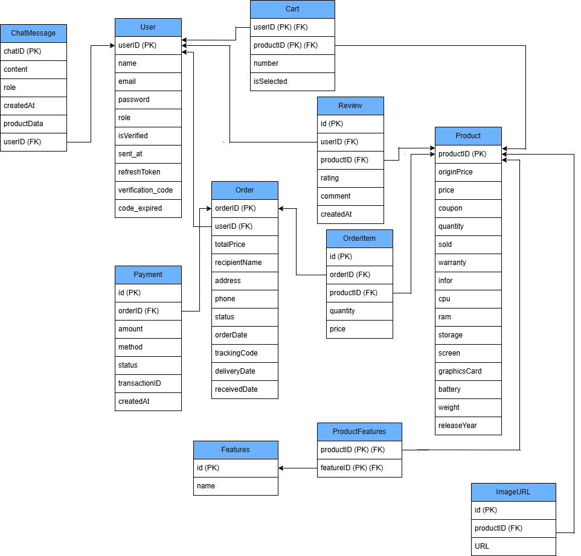

# 🛍️ TechZone – Fullstack E-commerce System

Trang web mua sắm laptop trực tuyến | Fullstack với **React + Nestjs + Prisma**

## 📘 Tổng quan

**TechZone** là một nền tảng thương mại điện tử mini, cho phép người dùng:

- Đăng ký / đăng nhập / xác thực email
- Quản lý thông tin cá nhân
- Xem và mua sản phẩm laptop
- Quản lý đơn hàng và thanh toán (trong tương lai)

Dự án bao gồm:

- 🧠 **Backend**: REST API với NestJS, Prisma, JWT, Argon2
- 💻 **Frontend**: React + Vite + React-Bootstrap + Axios
- 🗄️ **Database**: PostgreSQL

---

## 🔄 Migration from Node.js Version

Originally built with Node.js (Express):
https://github.com/dangngockhieu/Do_an1.git

This version was re-implemented using Spring Boot to achieve:

- Strong type safety
- Better structured architecture
- Improved scalability for larger systems

---

## 🚀 Development Journey & Migration

This project was developed in two main phases to experiment with and optimize the backend architecture:

- **Phase 1 (10/2025 – 12/2025):** Built the complete MVP (Minimum Viable Product) using **Node.js Express**. The focus was on rapid development and delivering core e-commerce functionalities.
- **Phase 2 (02/2026 – 03/2026):** Successfully migrated the entire backend system to **Nestjs**.
  - **Why Migrate?** Purpose: Adopt strict OOP principles, improve scalability, and utilize a structured architecture for better transaction handling and security.
  - **Outcome** Re-architected the system using a layered approach, resulting in improved maintainability and enhanced query performance with PostgreSQL.

---

## ⚙️ Công nghệ chính

| Phần         | Công nghệ                           | Mô tả                            |
| ------------ | ----------------------------------- | -------------------------------- |
| **Frontend** | React, Vite, React-Bootstrap, Axios | Giao diện web hiện đại           |
| **Backend**  | NestJS, Prisma ORM, Argon2          | Xử lý logic & API                |
| **Auth**     | JWT, Cookies, Email Verification    | Hệ thống xác thực                |
| **Mailer**   | Nodemailer + Gmail App Password     | Gửi mail xác thực/reset password |
| **Database** | PostgreSQL                          | Lưu trữ dữ liệu                  |

---

### 🎨 Figma Design

🔗 [View Figma Design](https://www.figma.com/design/TrdxY3Fw1Iz9EdEhLgBJvc/Untitled?node-id=0-1&p=f&t=2A3bGnTvSRHaNvSl-0)

---

## 🗄️ Database Design



This diagram shows the main entities and relationships of the TechZone backend.

---

🧰 Cài đặt và chạy toàn bộ dự án
⚙️ Yêu cầu
Node.js >= 18

PostgreSQL

Git

## 📥 1️⃣ Clone project

```bash
git clone https://github.com/dangngockhieu/Techzone.git
cd Techzone
```

---

## ⚙️ 2️⃣ Cài đặt Backend

```bash
cd backend
npm install
```

Tạo file `.env` dựa trên `.env.example`

---

## 🗄 3️⃣ Tạo và migrate database

```bash
npx prisma migrate dev --name init
npx prisma generate
```

---

## 🌱 4️⃣ Seed dữ liệu mặc định

Backend sẽ tự động seed khi khởi động lần đầu.

---

## ▶️ 5️⃣ Chạy Backend Server

```bash
npm run dev
```

---

## 🎨 6️⃣ Cài đặt Frontend

Mở terminal mới:

```bash
cd ../frontend
npm install
```

Tạo file `.env` trong thư mục `frontend`.

---

## ▶️ 7️⃣ Chạy Frontend

```bash
npm run dev
```

---

## 🔐 Các tính năng chính

| Nhóm           | Tính năng                       | Mô tả                          |
| -------------- | ------------------------------- | ------------------------------ |
| Auth           | Đăng ký / Đăng nhập / Đăng xuất | Có xác thực email và JWT       |
| Email          | Xác thực qua email              | Gửi link xác minh              |
| Token          | Refresh Token                   | Làm mới JWT khi hết hạn        |
| Reset Password | Gửi mã đặt lại qua email        | Có thời hạn sử dụng            |
| User           | Cập nhật thông tin cá nhân      | Chỉnh sửa thông tin người dùng |
| Admin          | Quản lý người dùng / sản phẩm   | CRUD nâng cao                  |

---

🧠 Dev Notes
Mật khẩu được mã hóa bằng Argon2

Token được ký bằng JWT (access + refresh)

Xác thực qua HTTP-only Cookie

Prisma được khởi tạo theo Singleton pattern để tránh leak connection
